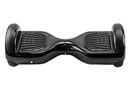
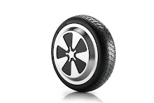
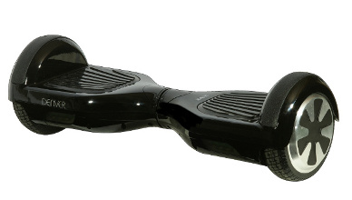
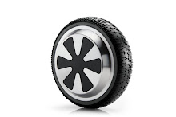

# Hoverboards: Whats inside?

This is an repo dedicated to documenting hoverboard motor wheels.

The data has been gathered personally, by youtube videos and other pages on github.

Feel free to report any errors by opening an issue.

Disclaimer: the table below is work in progress and will be updated later.

|                Picture(s)                    |   Brand   | Flashable | Motor Size    | Motor Image               | Stator  | 
| ----------------------------------------------- | --------- | --------- | ---------------- | ---------------------------- | ------------ |
|  | Different |  Normal   |        6.5"      |  | 35mm |
|  |  Denver   |  Split    |        6.5"      |  | 20mm |

All motors have hall sensors that are 120° apart.

To save cost, over the time, stators have gotten smaller and the wires thinner. The approx. stator size is a good reference for what the motor can handle. One with 30 or 35mm stator is likely to handle the full 350w, one with 20mm stator not.
